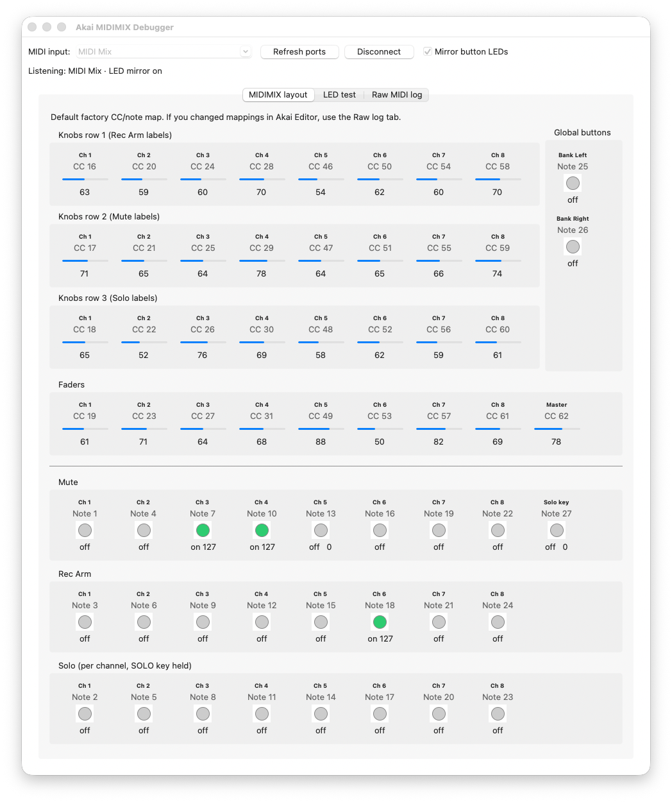
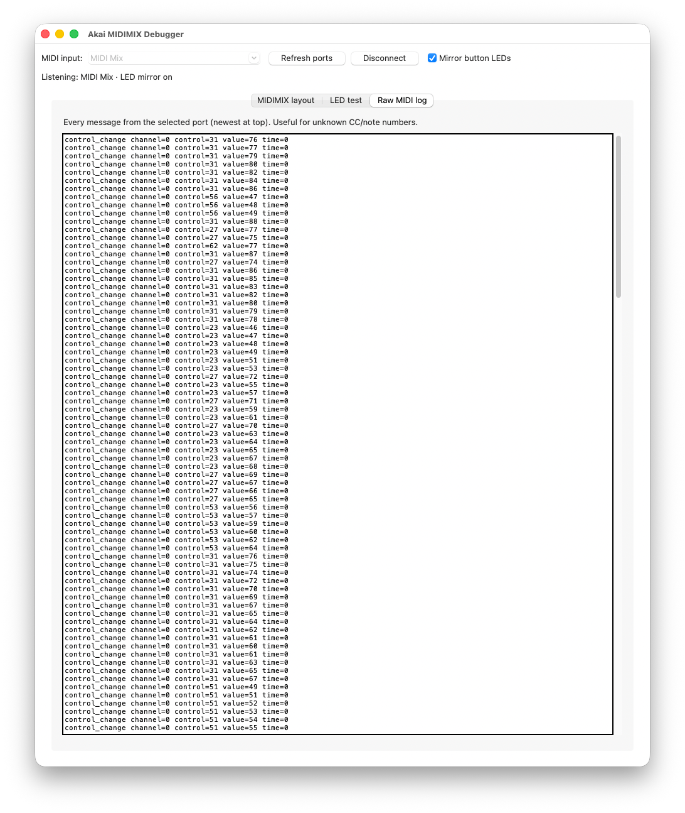
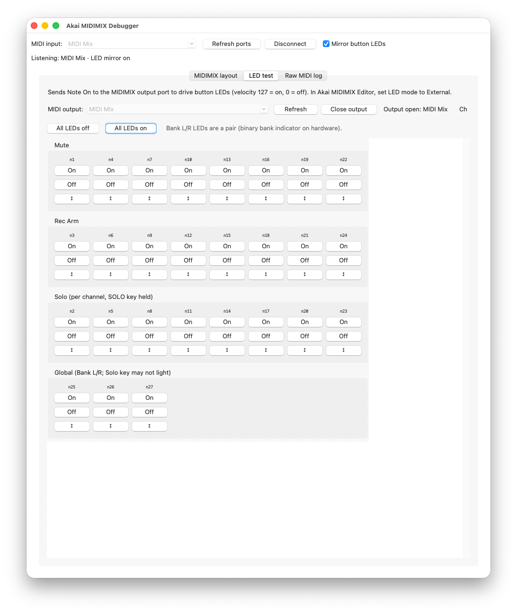

# MIDIMIX Debugger

Small Python GUI to visualize **Akai MIDIMIX** knobs, faders, and buttons and see the exact MIDI values they send.

## Project layout

| File | Role |
|------|------|
| `midimix_factory.py` | Factory CC/note map, `MidimixFactory` class (MIDI in/out, LED commands, state) |
| `midimix_debugger.py` | Tkinter GUI |

## Setup

```bash
cd ~/Projects/midimix-debugger
python3 -m venv .venv
source .venv/bin/activate
pip install -r requirements.txt
```

## Run

```bash
python midimix_debugger.py
```

1. Choose your MIDIMIX input port (often named like `Akai MIDIMIX`).
2. Click **Connect**.
3. Move controls — values update on the **MIDIMIX layout** tab; every message appears on **Raw MIDI log**.

The layout tab uses the **factory default** CC/note map. If you customized the unit with Akai’s editor, rely on the raw log for the numbers you actually receive.





## LED test

On the **LED test** tab:

1. In **Akai MIDIMIX Editor**, set button **LED mode** to **External** and send that config to the device.
2. Select the MIDIMIX **MIDI output** port and click **Open output**.
3. Use **On** / **Off** / toggle per note, or **All LEDs on/off**.

When you **Connect** on the main toolbar, the app opens the matching MIDI **output** automatically (if **Mirror button LEDs** is checked) and toggles each button LED on every press.

To load current knob/fader positions into the app, press **SEND ALL** on the MIDIMIX (the hardware does not expose a reliable software equivalent).

LEDs are driven with **Note On** (velocity 127 = on, 0 = off) on the factory default note numbers. The Solo key often has no LED; bank arrows use a paired binary indicator on the hardware.


