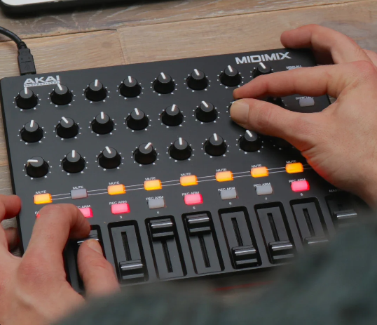

# akai-midimix

Tools for the **Akai MIDIMIX** controller using the factory-default MIDI map.



## Source code

All application code lives under [`src/`](src/):

| Folder | Description |
|--------|-------------|
| [`src/python/`](src/python/) | Tkinter MIDI debugger — visualize CC/note values and test LEDs |
| [`src/web/`](src/web/) | Wave visualizer — configure 8 sine waves from knobs/faders and plot them |

## Python debugger

```bash
cd src/python
python3 -m venv .venv
source .venv/bin/activate
pip install -r requirements.txt
python midimix_debugger.py
```

See [`src/python/README.md`](src/python/README.md) for screenshots and LED setup.

## Web wave visualizer

```bash
cd src/web
npx --yes serve .
```

See [`src/web/README.md`](src/web/README.md) for control mapping and setup (Web MIDI, External LED mode).

## License

Apache 2.0 — see [LICENSE](LICENSE).
